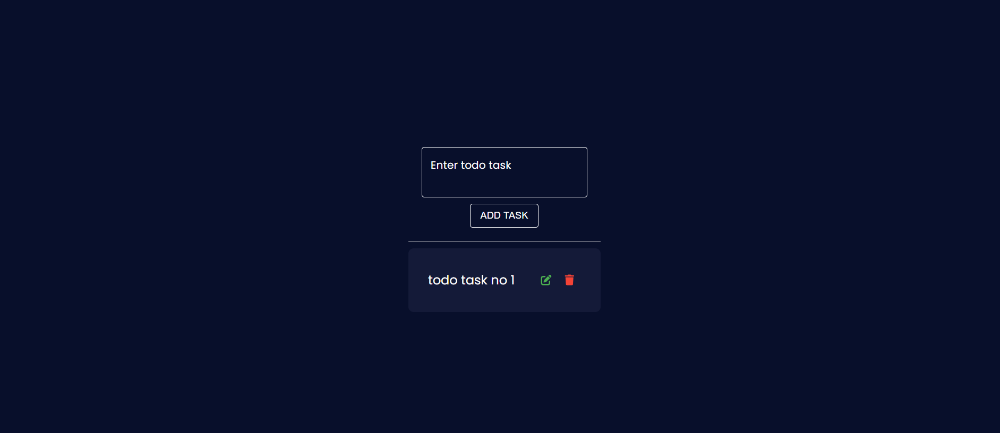

# Local Storage Todos App

A simple, minimalistic to-do list application where users can create, edit, and delete tasks. The app stores tasks locally in the browser using **Local Storage**. This project is built with **React.js** and styled with **Tailwind CSS** for a responsive and clean UI.

## Table of Contents

- [Features](#features)
- [Screenshots](#screenshots)
- [Installation](#installation)
- [Usage](#usage)
- [Technologies Used](#technologies-used)
- [Contributing](#contributing)
- [License](#license)

## Features

- **Add Todos**: Users can create new tasks to keep track of.
- **Edit Todos**: Edit existing tasks at any time to update the content.
- **Delete Todos**: Remove tasks that are no longer needed.
- **Mark as Complete**: Mark tasks as completed to keep an organized list.
- **Persist Data in Local Storage**: All tasks are saved locally in the browser's local storage, so they persist even after refreshing the page or closing the browser.
- **Responsive Design**: The application is fully responsive and works well on desktops, tablets, and mobile devices.

## Screenshots

### Home Page


### Adding a Todo


### Editing a Todo


> You can find all screenshots in the `screenshots` folder in the repository.

## Installation

1. Clone the repository:

    ```bash
    git clone https://github.com/your-username/todos-app.git
    ```

2. Navigate to the project directory:

    ```bash
    cd todos-app
    ```

3. Install dependencies:

    ```bash
    npm install
    ```

4. Start the development server:

    ```bash
    npm start
    ```

5. Open your browser and navigate to `http://localhost:3000`.

## Usage

- **Creating a Todo**: Type your task into the input field and click "Add" to create a new to-do.
- **Editing a Todo**: Click the "Edit" button next to a task to update its content.
- **Deleting a Todo**: Use the "Delete" button to remove any completed or unwanted tasks.
- **Mark as Complete**: Click the checkbox next to a task to mark it as completed.

All actions are saved automatically in your browser’s local storage, so your tasks will persist even after refreshing or reopening the browser.

## Technologies Used

- **Frontend**: React.js
- **Styling**: Tailwind CSS
- **Local Storage**: Browser's LocalStorage API to persist todos

## Contributing

Contributions are welcome! If you'd like to improve this project, feel free to fork the repository and submit a pull request.

1. Fork the repository
2. Create a new branch (`git checkout -b feature-branch`)
3. Make your changes
4. Commit your changes (`git commit -m 'Add new feature'`)
5. Push to the branch (`git push origin feature-branch`)
6. Open a pull request

## License

This project is licensed under the MIT License - see the [LICENSE](./LICENSE) file for details.

---

Feel free to create issues if you encounter any bugs or have feature requests!
